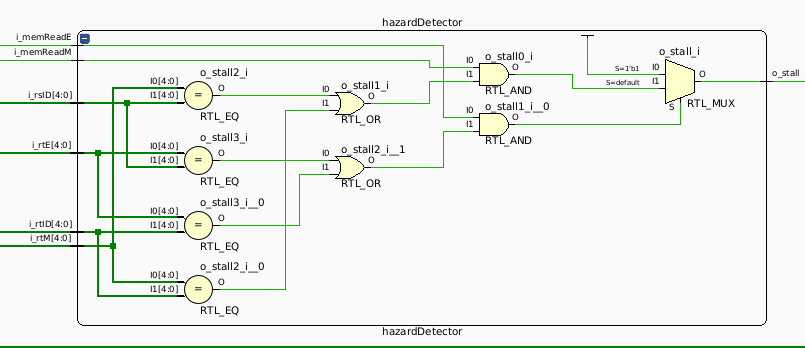

# MIPS Processor Pipeline

### Arquitectura de computadoras - Ingeniería en Computación

Autores: 
- Octavio Ulla <octavio.ulla@mi.unc.edu.ar>
- Francisco Cabrera <francisco.cabrera@mi.unc.edu.ar>
---

## Introducción
El presente informe detalla el desarrollo y la implementación del pipeline de ejecución de un procesador MIPS utilizando el lenguaje de descripción de hardware Verilog.

Las etapas implementadas en el pipeline de ejecución son:
- IF (Instruction Fetch): Búsqueda de la instrucción en la memoria de programa.
- ID (Instruction Decode): Decodificación de la instrucción y lectura de registros.
- EX (Execute): Ejecución de la instrucción.
- MEM (Memory Access): Lectura o escritura de la memoria de datos.
- WB (Write Back): Escritura de los resultados en los registros.

El pipeline de ejecución tiene soporte para las siguientes instrucciones:
- R-Type:
    - SLL, SRL, SRA, SLLV, SRLV, SRAV, ADDU, SUBU, AND, OR, XOR, NOR, SLT
- I-Type:
    - LB, LH, LW, LWU, LBU, LHU, SB, SH, SW, ADDI, ANDI, ORI, XORI, LUI, SLTI, BEQ, BNE, J, JAL
- J-Type:
    - JR, JALR

Además, el procesador implementado detecta y elimina los riesgos estructurales, de datos y de control.

Para la programación y uso del procesador, se desarrolló una aplicación que permite ensamblar el código para generar las instrucciones hexadecimales que serán cargadas a la memoria de programa. Dicha aplicación permite también la carga de estas instrucciones en el procesador a demás de la posibilidad de realizar la ejecución continua o paso a paso de un programa. En cada paso que se de desde la aplicación, se presentará en la misma el valor de los registros de procesador, la memoria de datos y el valor del program counter actual.

## Etapas de ejecución

Cada una de las etapas de ejecución dentro del pipeline se encarga de una parte de la ejecución de una instrucción. El procesador segmentado, permite que en cada pulso de clock se lance la ejecución de una nueva instrucción (si no hay riesgos). Por lo tanto, en cada una de las etapas del pipeline se estará ejecutando tareas de diferentes instrucciones.  

Para lograr esto, es necesario que se agreguen entre cada una de las etapas un buffer que conserve durante el periodo de reloj, las entradas de cada etapa y luego actualice dichas entradas con las salidas de la etapa anterior. 

En la siguiente figura, se muestra un pipeline básico de un MIPS con las etapas y buffers correspondientes:

A continuación, se detalla cada una de las etapas implementadas en el pipeline.

### Instruction Fetch (IF)

Esta etapa es la encargada de buscar la instrucción apuntada por el contador de programa dentro de la memoria de instrucciones y presentarla a su salida para su proximo uso. También permite almacenar instrucciones dentro de la memoria.

Esta etapa está formada por los siguientes módulos:

- **ProgramCounterMux:** Multiplexor que permite elegir la fuente de program counter. Este puede ser el PC actual incrementado en 4 o un PC producto de la ejecución de una instrucción de salto.
- **ProgramCounter:** Este módulo mantiene el valor del program counter durante un ciclo de reloj.
- **ProgramCounterIncrement:** Este módulo es un sumador, que en cada flanco de reloj incrementa el valor del program counter en 4.
- **InstructionMemory:** Memoria en la cual se almacenan las instrucciones de un programa.

### Instruction Decode (ID)

En esta etapa es donde se decodifica la instrucción que es presentada por la unidad de búsqueda. Al decodificarla, se obtiene: El código de operación, registros involucrados, valores inmediatos y código de función. A partir de la decodificación se generan las señales de control que serán usadas por las etapas siguientes para realizar la correcta ejecución de la instrucción.

Esta etapa está formada por los siguientes sub módulos:

- **Registers:** Banco de registros.
- **ControlUnit:** Unidad que genera las señales de control.
- **SignExtend:** Extensor de signo para valores inmediatos.
- **BranchControl:** Unidad de control para instrucciones de tipo branch. Este módulo se encarga de realizar el cálculo de la dirección de salto y la evaluación de la condición (Se encuentra en la etapa de decode para la implementación de saltos retardados).
- **MUXD1:** Este multiplexor es el encargado de insertar stalls en el pipeline en función de una señal de control.
- **MUXD1F y MUXD2F:** Estos multiplexores se utilizan para elegir la fuente de los datos, esto es, salida de registro, cortocircuito de la etapa de memoria, cortocircuito de la etapa de ejecución. Estos mux son controlados por la unidad de corto circuito.

### Execute (EX)

En esta etapa se realizan los cálculos que requiera la instrucción. 

Este módulo esta compuesto por los siguientes sub módulos:

- **AluControl:** Se encarga de, a partir de algunas señales de control generadas en la etapa de decode, entregar a la alu el código de operación correcto (suma, resta, shift, etc).
- **MUXD1 y MUXD2:** Dependiendo del tipo de instrucción, los registros (o datos) que intervienen en el cálculo pueden ser diferentes. Con estos multiplexores se eligen los operandos que serán enviados a la ALU.
- **ALU:** Unidad aritmético lógica que realiza operaciones sobre dos valores de entrada.
- **MUXWR:** Elige el registro de destino en el que se almacenará un valor.

### Memory Access (MEM)

En esta etapa se realizan las lecturas y escrituras de la memoria de datos.

Este módulo, unicamente está formado por un sub módulo:

- **dataMemory:** Bloque de memoria que permite la lectura y escritura de valores.

### Write Back (WB)

Esta etapa se encarga de la escritura de los resultados en los registros. El multiplexor interno del módulo se encarga de elegir cual es el valor que será escrito efectivamente en los registros.

## Riesgos
Para la detección y eliminación de riesgos se agregaron dos nuevos módulos.

### Forwarding Unit

Esta unidad, genera señales de control que controlan los multiplexores mencionados en la etapa de decode para cambiar la fuente de los operandos de la instrucción. Se encarga de verificar la presencia de riesgos de datos y eliminarlos generando estos "cortocircuitos". Para la detección de los riesgos realiza comparaciones entre los registros que se usan en las diferentes instrucciones que se encuentran en el pipeline.

## Hazard Detector

Este módulo se encarga de detectar riesgos (de datos o de control) y en caso de ser necesario, insertar burbujas (stalls) dentro del pipeline para dar tiempo a que el riesgo ya no exista. Para la detección de los riesgos realiza la comparación de registros y señales de control.

## Unidad de debug
Se implementó una unidad que se conecta al procesador para poder realizar la programación, depuración y ejecución del mismo. 

Esta unidad de debug cuenta con un módulo UART que recibe comandos desde una PC para realizar las acciones antes mencionadas. Además envía a la PC el estado del procesador para poder realizar el debug.

Como puede verse en la imagen, la unidad de debug también cuenta con módulo llamado debugInterface que es el encargado de interpretar los comandos provenientes de la UART para realizar las acciones sobre el procesador.

## IDE

Se desarrolló una aplicación (directorio PyMips) para la programación y uso del procesador. Para su uso, simplemente correr el archivo mipsIde.py que se encuentra en el directorio (se debe configurar el puerto com en el cual se encuentra la placa). En la ventana principal se encuentra un cuadro de texto para escribir el código fuente, un cuadro de texto que muestra el código ensamblado, tablas para mostrar el valor de los registros y memoria y diferentes botones para ensamblar, programar, reiniciar y ejecutar programas sobre el procesador.

